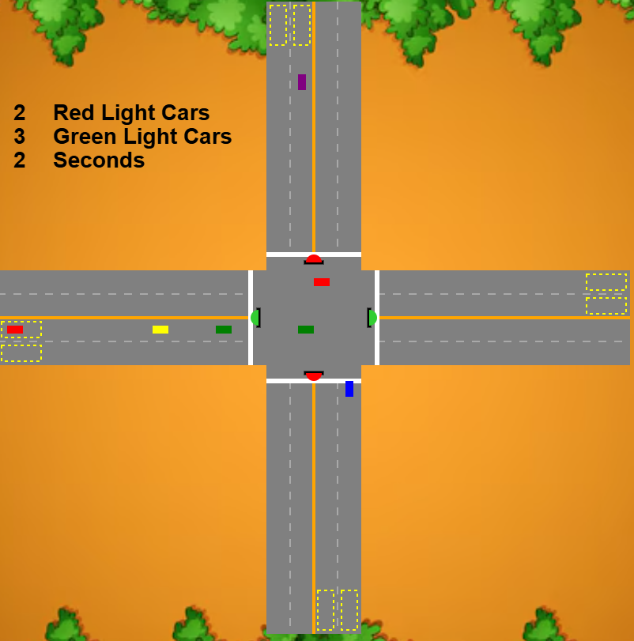
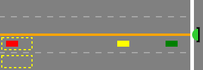

# **🚦 AI Traffic Controller**

A Flask web application that uses a neural network (`queryNN`) to predict traffic light changes based on real-time car data at an intersection.

A live instance of this project can be viewed at:  
[View Live Instance](https://traffic-controller.onrender.com)

---


## **📌 Features**

- Receives traffic data via a `/traffic_data` API endpoint.
- Uses an AI model (`queryNN`) to predict optimal light changes.
- Renders an interactive `index.html` page for users.
- Supports visualization of real-time traffic decisions.

---

## **🛠️ Installation**

### **1️⃣ Clone the Repository**

```bash
git clone https://github.com/JBratvold/TrafficController
cd your-repo
```

### **2️⃣ Install Dependencies**

```bash
pip install -r requirements.txt
```

### **3️⃣ Run the Flask App**

```bash
python app.py
```

The app will run at:\
[**http://127.0.0.1:5000/**](http://127.0.0.1:5000/)

---

## **🚀 Usage**

### **1️⃣ Start the Application**

After running `app.py`, visit [**http://127.0.0.1:5000/**](http://127.0.0.1:5000/) to view the interface.

### **2️⃣ API Endpoints**

| Endpoint        | Method | Description                                           |
| --------------- | ------ | ----------------------------------------------------- |
| `/`             | GET    | Serves the `index.html` page.                         |
| `/traffic_data` | POST   | Accepts JSON traffic data and returns AI predictions. |

### **Example Traffic Data Request**

Send a POST request with JSON data:

```json
{
  "red": 10,
  "green": 1,
  "seconds": 20
}
```

### **Example JSON Response**

```json
{
  "prediction": "1"
}
```

---

## **🧠 Neural Network Details**

The AI model used in this project (`queryNN`) predicts whether a traffic light should change based on three input values:

1. **Red Cars**: Number of cars waiting at a red light.
2. **Green Cars**: Number of cars at the green light.
3. **Time Since Changed**: Time (in seconds) since the last light change.

The AI model is built using **[python]** and trained on sample traffic data to optimize light timing.

### **How It Works:**

- **Input**: The model receives live traffic data (cars at red, cars at green, seconds since last light change).
- **Processing**: The neural network evaluates congestion patterns and predicts whether to switch the light.
- **Output**: The AI suggests "0" (Keep light as is) or "1" (Switch light to green/red).

> 🛠️ **Training Data**: The model is trained using traffic simulation data with supervised learning techniques.

---

## **📊 Visualization Examples**

### **📌 Traffic Decision Chart**

This visualization represents the AI's decisions based on different traffic conditions:

| Red Cars | Green Cars | Time Since Changed | AI Decision   |
| -------- | ---------- | ------------------ | ------------- |
| 5        | 2          | 2                  | 0 (Keep Same) |
| 12       | 3          | 20                 | 1 (Switch)    |
| 8        | 6          | 15                 | 0 (Keep Same) |
| 15       | 1          | 30                 | 1 (Switch)    |

### **📌 Traffic Simulation Screenshot**




---

## **⚙️ Dependencies**

Ensure the following are installed:

- Flask
- NumPy (for AI calculations)
- Gunicorn (for production deployment)

You see the list of dependencies in `requirements.txt`:

---

## **🤝 Contributing**

1. Fork the repository
2. Create a feature branch (`feature-branch`)
3. Commit your changes
4. Submit a pull request

---